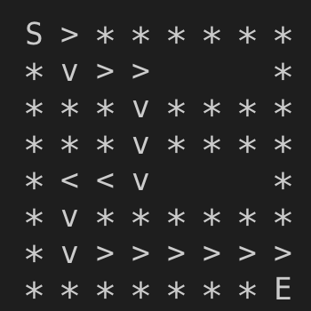
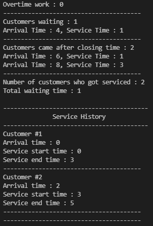

# DATA_STRUCTURE STUDY

# 🏁 CURRICULUM

## ✔️ Day1
- array
- linked list

## ✔️ Day2
- circular linked list
- double linked list
- polynomial addtion
- reverse linked list

## ✔️ Day3
- stack array
- stack linked list

## ✔️ Day4

- stack maze

## ✔️ Day5
- circular queue
- deque
- queue

## ✔️ Day6

- queue simulation

## ✔️ Day7
- binary tree traversal
- binary tree

## ✔️ Day8
- binary search tree(BST)
- heap

## ✔️ Day9
- array graph
- linked list graph

## ✔️ Day10
- dijkstra
- floyd
- kruskal
- minimun spanning tree
- prim

## ✔️ Day11
- bubble sort
- selection sort
- insertion sort
- merge sort
- heap sort
- radix sort
- quick sort

## ✔️ Day12
- linear search
- binary search
- hash search
- BST

## 🌻 RUN
`make all`
`./data_structure + NUMBER`
